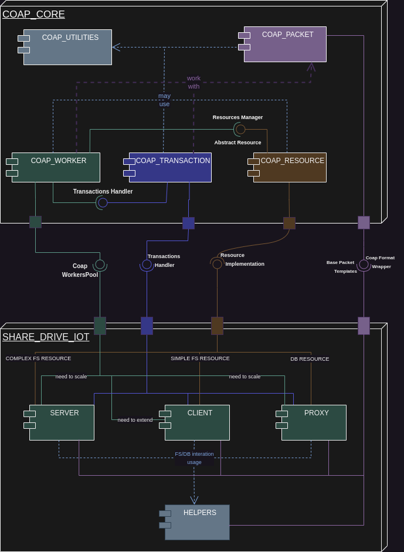
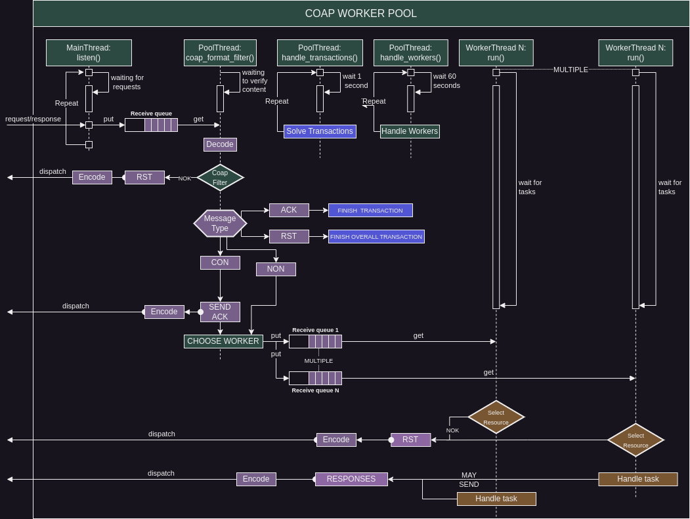
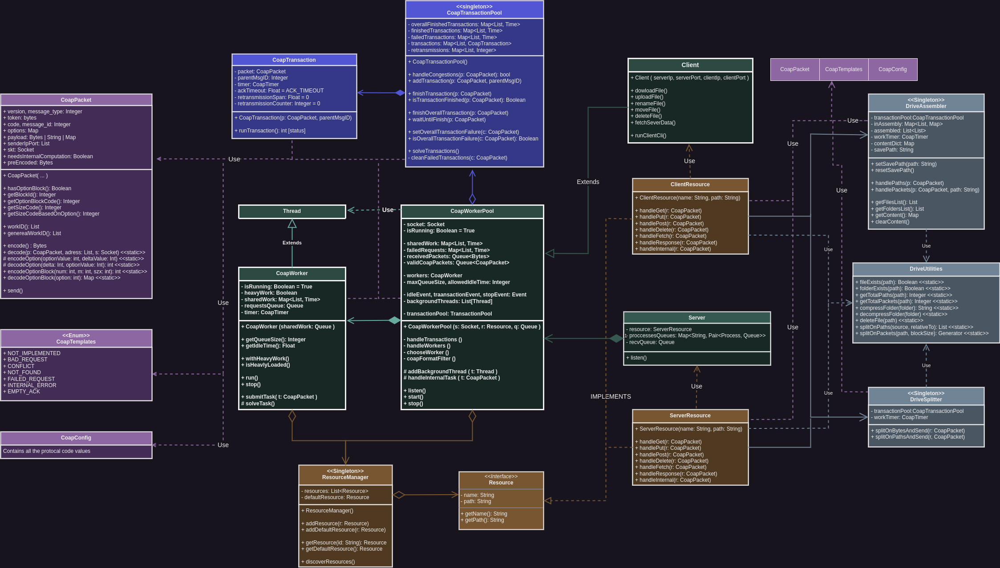
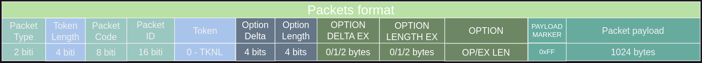

## Overview
1) [Architecture](#1-architecture-design)
   1) [Component diagram](#i-component-diagram)
   2) [Sequence diagram](#ii-sequence-diagram)
   3) [Class diagram](#iii-class-diagram)
2) [Coap Protocol](#2-coap-protocol)
   1) [Description](#i-protocol-information)
   2) [Packet format](#ii-coap-packet-format)
   3) [Block Wise Protocol](#iii-block-wise-transfer)
      1) [Key concepts](#key-concepts)
      2) [Slower flow](#standard-like-flow)
      3) [Faster flow](#faster-flow-methodpersonal-advice)
3) [POC arhitecture implementation](#3-poc-arhitecture-implementation)
3) [Sources](#4-sources)

# 1. Architecture Design

## I. Component Diagram
### Purpose of the Component Diagram

- The Component Diagram offers a higher-level view, focusing on the implementation of a robust **CORE** that lays the foundation for CoAP-oriented applications.
- The **core block** is designed to provide a set of ready-to-use component interfaces, with internal logic centered around resource-based interactions.

#### Interactions with Other Blocks

- The **Transaction component** interfaces with the external environment through a **TransactionHandler subcomponent**.
- The **CoapWorker** exposes a scalable component, **CoapWorkerPool**, to the external environment.
- The **CoapResource component** requires external implementations of the **resource interface**.
- The CoAP-related **CoapPacket** acts as a wrapper over the **CoAP format** (encoder, decoder, config).
- The **Core block** includes a dedicated component for internal utilities, labeled as **Coap Utilities** (logger, timers, etc.).

#### Utilization Across CoAP Application Components

- The **core block** is intended for deployment in all CoAP application components. 
- Notably, the logic of application components (e.g., shared drive) should display high coupling—behavioral logic between the server/client/proxy—while being decoupled from the **core block**.<br> The core block should function as an intermediary for these logics.
- Each application component defines its behavior through its **resource implementations**.
<br><br>



## II. Sequence Diagram
### Purpose of the Sequence Diagram

The Sequence Diagram elucidates the internal flow of the **CoapWorkerPool**,
a critical component requiring a detailed representation of its operations.

#### Responsibilities of CoapWorkerPool

1. **Request/Response Handling:** A dedicated thread collects requests/responses swiftly.
2. **Transaction Management:** One thread oversees registered transactions.
3. **Worker Supervision:** Another thread manages internal workers, each controlled by a timer.

#### Processing Received Messages

- A thread, dependent on the listen thread, decodes received content, applies a CoAP format filter, and designates tasks to specific workers based on factors like load, priority, and previous task-solving time.
- The **CoapWorkerPool** can scale with multiple workers, each responsible for tasks associated with specified resources in requests/responses.

#### Versatility in Usage

- The **CoapWorkerPool** can be utilized in diverse ways, such as server replication on multiple processes or extension for client purposes.
<br><br>



## III. Class Diagram
### Purpose of the Class Diagram

The Class Diagram offers a detailed view of each component, emphasizing class structure and interactions.

- It provides an overview of methods within each class and illustrates their interactions as a whole.
- Language-specific workarounds may exist, potentially reducing methods for some classes, but the overall interactions remain defined.
<br><br>



# 2. CoAP Protocol

## I. Protocol Information

The Constrained Application Protocol (CoAP) is a specialized web transfer protocol designed for resource-constrained devices and networks, particularly in low-bandwidth, high-latency, or limited processing environments.<br>
It facilitates communication between devices, using a lightweight client-server architecture and a request-response model.

Key features of CoAP:

- RESTful Design: CoAP adopts a Representational State Transfer (REST) style, enabling device interaction through standard HTTP methods (GET, PUT, POST, DELETE).
- Low Overhead: CoAP minimizes protocol overhead through binary encoding and optimized message size for efficient communication in constrained networks.
- UDP Transport: CoAP utilizes the User Datagram Protocol (UDP) for a lightweight transport layer, suitable for resource-constrained devices, such as those in Internet of Things (IoT) applications.

For a more detailed view of the protocol, please visit: https://datatracker.ietf.org/doc/html/rfc7252

## II. CoAP Packet Format


- **Version (Ver)**: Indicates the version of the CoAP protocol. 
- **Type**: Specify the message type (Confirmable, Non-confirmable, Acknowledgment, or Reset). 
- **Token Length (TKL)**: Indicates the length of the Token field in bytes. 
- **Code**: Specify the CoAP method or response code. 
- **Message ID**: A 16-bit identifier used to match requests and responses.
- **Token**: Variable length field (0–8 bytes) whose length is indicated by the Token Length field in the header.<br> Used for message matching between requests and responses.
- **Options**
  - Option Delta (OD)/Option Delta Extended: Indicates the difference between the current option number and the previous one.
  - Option Length (OL)/Option Length Extended: Specifies the length of the option value in bytes.
  - Option Value: Carries specific information based on the option number.
- **Payload**: Carries the data being sent in the CoAP message.The presence and format of the payload depend on the CoAP method or response code.

For further information, please consult: https://datatracker.ietf.org/doc/html/rfc7252#autoid-9

### III. Block Wise Transfer
Block-wise transfer divides a large payload into smaller blocks, which can be individually transferred. This allows for better handling of unreliable networks and resource-constrained devices. The sender and receiver negotiate the block size and exchange blocks until the entire payload is transferred.

For further information, please consult: https://datatracker.ietf.org/doc/html/rfc7959
#### Key Concepts

- **Block Option**: The Block option in a CoAP message provides information about the current block being transferred. It includes the block number, block size, and a more bit indicating whether there are more blocks to be sent.

- **Block Size Negotiation**: The block size negotiation happens during the CoAP handshake. The client indicates its preferred block size in the request, and the server responds with its preferred size. The final block size is chosen based on the minimum of the two preferences.

- **Block-wise Transfer on the Client Side**:
    - The client initiates a request with the Block1 option to indicate support for block-wise transfers in the request payload.
    - The server responds with the agreed block size and the first block of data.
    - The client then continues to request subsequent blocks until the entire payload is received.
- **Block-wise Transfer on the Server Side**:
    - The server receives a request with the Block1 option and identifies the requested block size.
    - It sends the requested block to the client, along with information about the next block (if any).
    - The server continues to respond with subsequent blocks until the entire payload is transferred.

### Standard Like Flow
- Slower, but low compute power.

```plaintext
Client: GET /large-resource
  -> Token: 0x8D
  -> Block1: Size=512, NUM=0, M

Server: 2.05 Content
  <- Token: 0x8D
  <- Block1: Size=512, NUM=0, M
  <- Payload: [first 512 bytes of large resource]

Client: GET /large-resource
  -> Token: 0x8D
  -> Block1: Size=512, NUM=1, M

Server: 2.05 Content
  <- Token: 0x8D
  <- Block1: Size=512, NUM=1, M
  <- Payload: [next 512 bytes of large resource]

... (continue until entire resource is transferred)
```

### Faster Flow Method—Personal Advice
- Faster, but higher compute power.
```plaintext
Client: GET /large-resource
  -> Token: 0x8D
  -> Block1: Size=512, NUM=0, M

Server: 0.00 ACK
  <- Token: 0x8D
  <- Block1: Size=512, NUM=0, M
  <- Payload: [first 512 bytes of large resource]

Server: 2.05 Content
  <- Token: 0x8D
  <- Block2: Size=512, NUM=1, M=1
  <- Size2: 2
  <- Payload: [next 512 bytes of large resource]
  
Server: 2.05 Content
  <- Token: 0x8D
  <- Block2: Size=512, NUM=1, M=0
  <- Payload: [next 512 bytes of large resource]
 
Client: 2.31 Continue
  -> Token: 0x8D
  -> Block2: Size=512, NUM=0, M=1
  
Client: 2.31 Continue
  -> Token: 0x8D
  -> Block2: Size=512, NUM=0, M=0

```

# 3. POC arhitecture implementation

## I. Implementation notes
- This implementation adheres to the described architecture. It serves as a proof of concept, but for a serious implementation, it's recommended to use CPython, C++, or another high-speed language.
- This is an example of a command-based share drive application implemented in Python. However, the language choice introduces poor packet managing speed. A significant challenge with using Python is the Global Interpreter Lock (GIL), which can hinder concurrent execution of CPU-bound tasks.

## II. Demo video
[demo.webm](https://github.com/DamirDenis-Tudor/Cyberpunk-Platformer/assets/101417927/19c17b6b-2465-4562-a920-f6287d4eed4a)

## III. WireShark Capture
[Download capture.pcapng](arhitecture/demo/capture.pcapng)

# 4. Sources:
- https://datatracker.ietf.org/doc/html/rfc7252
- https://datatracker.ietf.org/doc/html/rfc7959
- https://docs.python.org/3.11/
- https://realpython.com/python-parallel-processing/
- https://chat.openai.com/